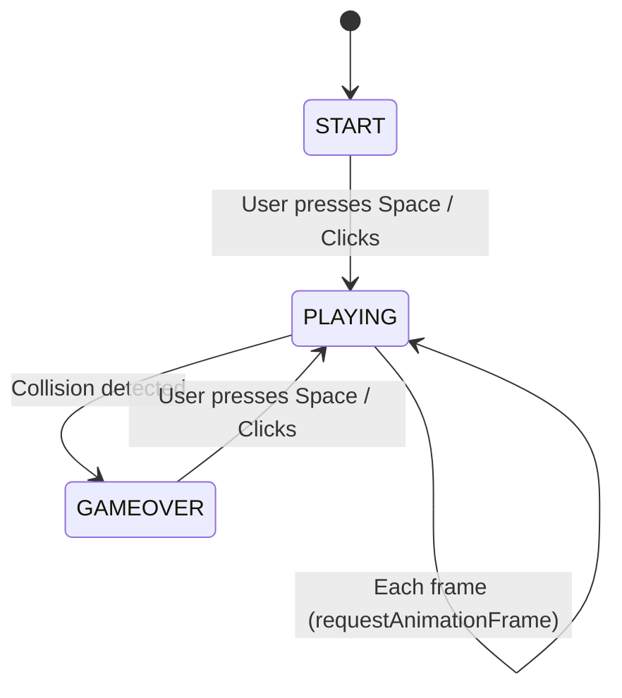
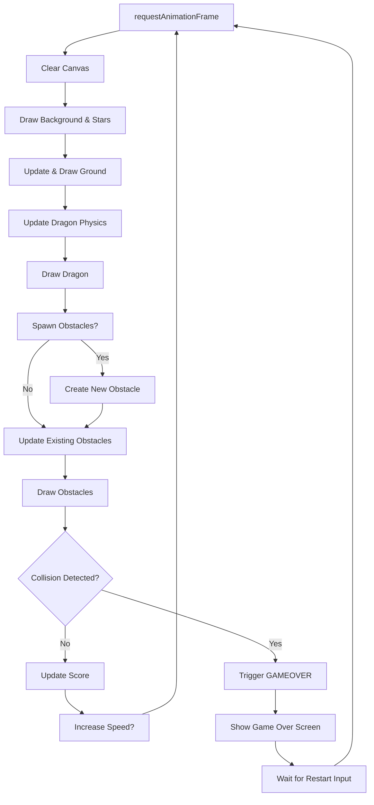
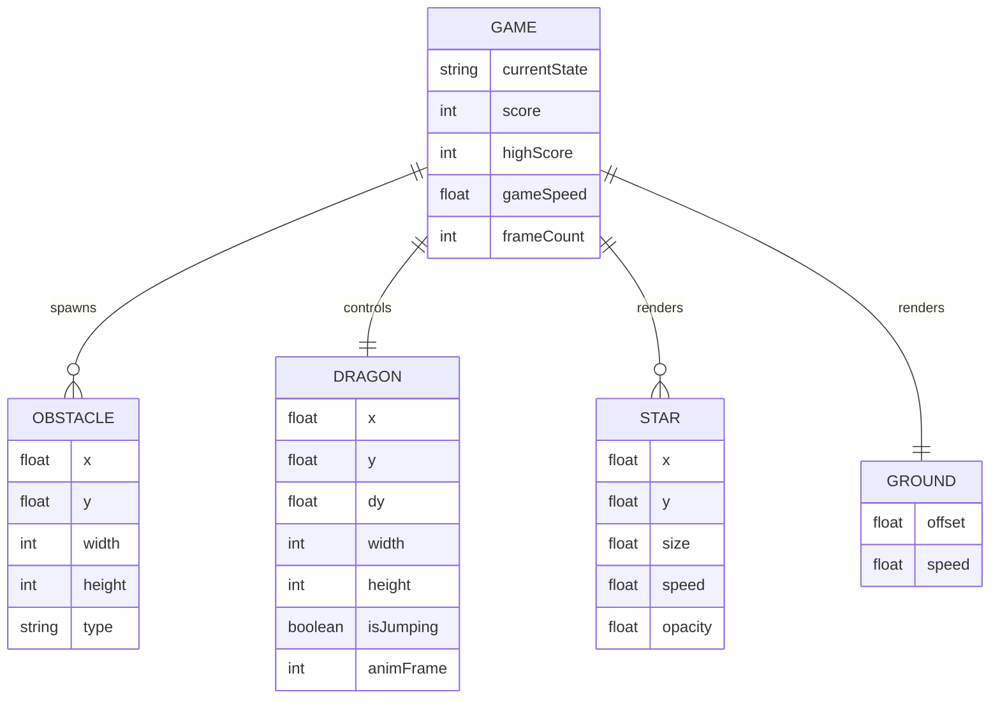
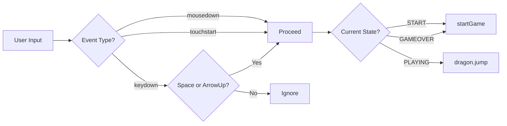
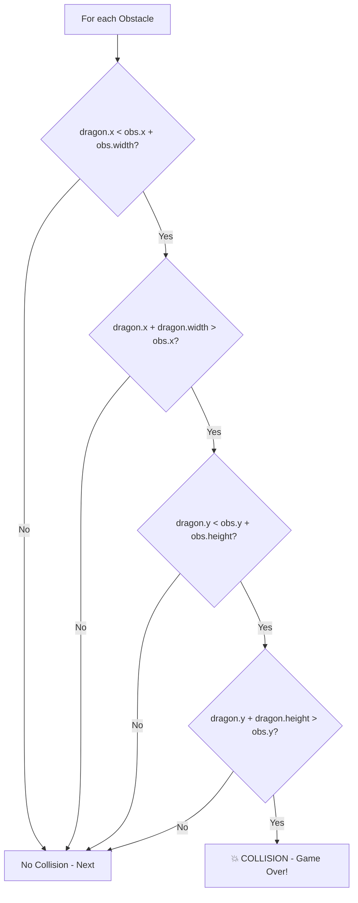
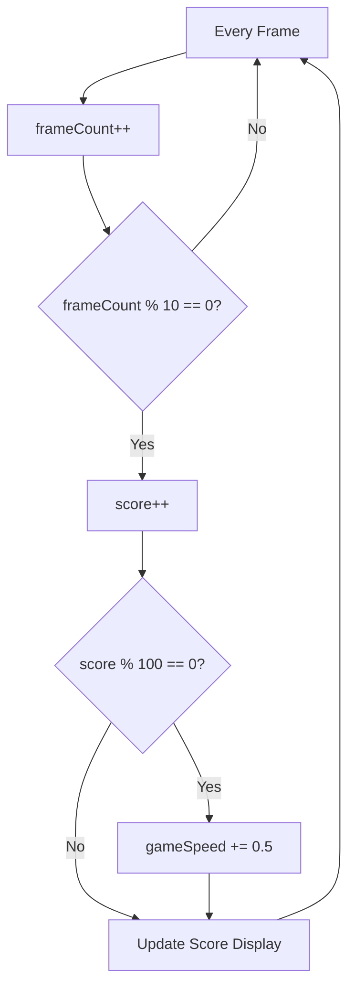

# 🐉 Web Space Dragon

> An endless-runner web game inspired by Chrome's offline Dinosaur game — set in outer space with a neon dragon.


---

## 📖 Overview

**Web Space Dragon** is a browser-based, single-player endless runner game. The player controls a Space Dragon running across an asteroid surface in deep space. Obstacles spawn from the right and rush towards the dragon — the player must jump to avoid them. The game gets progressively faster, and the goal is to survive as long as possible and beat your high score.

**No frameworks. No build tools. Pure HTML5 + CSS3 + Vanilla JavaScript.**

---

## 🎮 How to Play

| Action | Keyboard | Mouse / Touch |
|--------|----------|---------------|
| Jump | `Space` or `↑ Arrow` | Click / Tap anywhere |
| Start Game | `Space` or Click | Click / Tap anywhere |
| Restart | `Space` or Click | Click / Tap anywhere |

---

## 🏗️ Architecture

### Game State Machine



### Game Loop Flowchart



### Entity Relationship Diagram



### Input Handling Flow



### Collision Detection (AABB)



### Scoring & Difficulty Progression



---

## 📂 Project Structure

```
web-space-dragon/
├── index.html              # Main HTML entry point with Canvas & UI overlays
├── style.css               # All game styling, animations, responsive design
├── script.js               # Complete game engine (loop, physics, entities, input)
├── PROJECT_REQUIREMENTS.md # Detailed game design document
├── TASK_TRACKER.md         # Development task checklist
└── README.md               # This file
```

---

## 🚀 Quick Start

1. **Clone the repository:**
   ```bash
   git clone https://github.com/algorithnicmind/web-space-dragon.git
   ```
2. **Open in browser:**
   ```bash
   cd web-space-dragon
   start index.html
   ```
   Or simply double-click `index.html` — no server required.

3. **Play!** Press `Space` or click to start.

---

## 🛠️ Technical Stack

| Layer | Technology | Purpose |
|-------|-----------|---------|
| Structure | HTML5 | Canvas element, UI overlays, SEO meta tags |
| Styling | CSS3 | Neon glow effects, glassmorphism, animations, responsive layout |
| Logic | Vanilla JS | Game loop, physics engine, collision detection, state machine |
| Rendering | Canvas API | 2D sprite drawing, particle effects, parallax backgrounds |
| Storage | localStorage | High score persistence across sessions |

---

## ✨ Features

- 🐉 Animated space dragon with running & jumping sprites
- 🌌 Multi-layer parallax starfield background
- 🪨 Randomized obstacle spawning with variable sizes
- ⚡ Progressive difficulty (speed increases every 100 points)
- 🏆 Persistent high score via localStorage
- 📱 Fully responsive — works on desktop, tablet, and mobile
- 🎨 Neon cyberpunk aesthetic with glow effects
- 🖱️ Keyboard, mouse, and touch input support
- 🔄 Smooth 60fps game loop via requestAnimationFrame

---

## 📜 License

This project is open source and available under the [MIT License](LICENSE).

---

## 👨‍💻 Author

Built with ❤️ by **AlgorithmicMind**